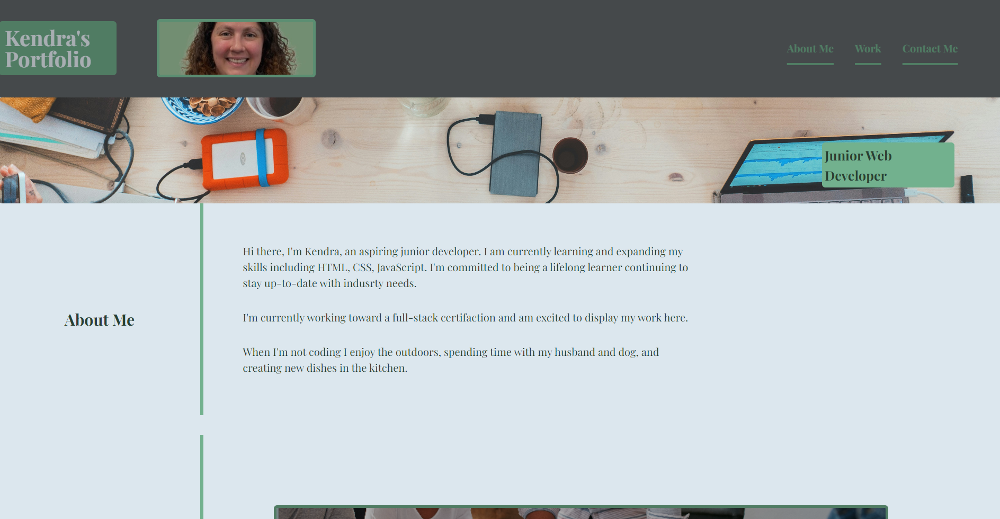
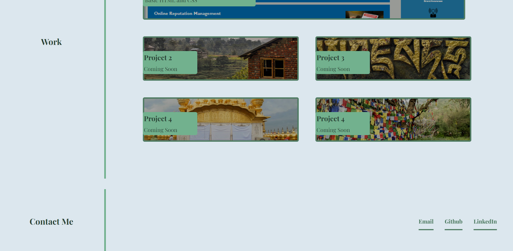

# Kendra's Portfolio

## Description

- I was motivated to learn aspects of CSS while putting it into action including but not limited to: flexboxes, pseudo-classes and media queries.
- I built this project to develop more skills and understanding of advanced css.
- I was able to create a professional portfolio where I can easily update the images, links and description of future projects.
- I learned how to utilize flexboxes, how to layout a webpage that is accessible for desktop, mobile and tablet users.

## License

See attached license in repo.

## Usage

## Features

Navigation links scroll to relevant sections of the page. Link to the first project goes to github page, and links to coming soon projects currently just going to google. Contact links go to relevant contact sources: email, github, and linkedin.

